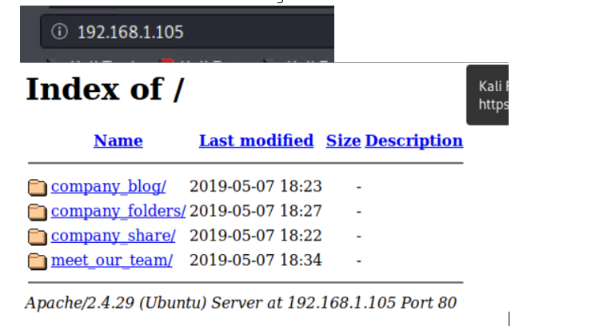
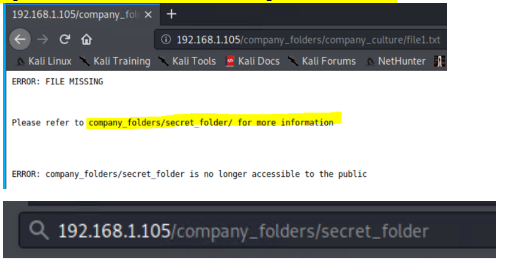
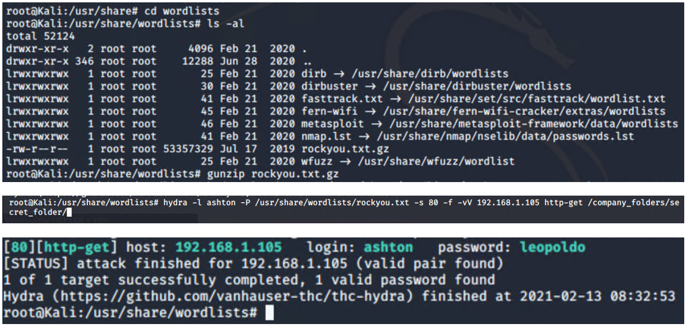
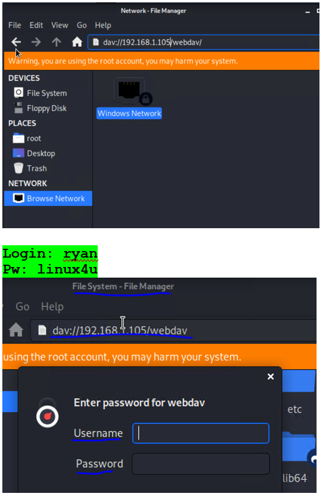
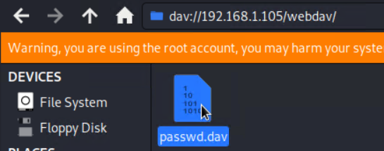
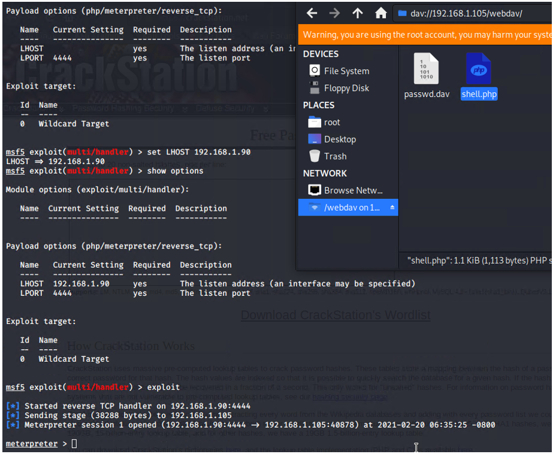

Penetration Tester/SOC-Analyst: Red-vs.-Blue-Red Team: 

### Step 1: Discover the IP address of the Linux server.
 
 
 
- From the Nmap scan we can see that port `80` is open. Open a web browser and type the IP address of the machine into the address bar.
 
 

- Open a web browser and navigate to 192.168.1.105
 
 

### Step 2: Locate the hidden directory on the server.
 
 
 

### Step 3: Brute force the password for the hidden directory.
- The directory asks for authentication in order to access it.
- Brute force into the directory, specifically Hydra
 
  
 
 
- Use the credentials to log into web browser

**Step 4: Connect to the server via Webdav**
-Use Crack Station; Navigate to `https://crackstation.net`;
 
  
 
  - The password is revealed as: `linux4u`

### Step 5: Connect to the server via WebDAV.
  - File System` shortcut from the desktop.
  - Browse Network`.
  - In the URL bar, type: `dav://192.168.1.105/webdav`; enter the credentials to log in.
 
 
 
 
 
 

OPEN NEW TERMINAL TO CONFIRM THE shell.php file is there.
Once confirmed, file was moved to webdav directory and executed
 

 
 

### Step 6: Upload a PHP reverse shell payload.
- set up the reverse shell
 
 
 
 
  - `set LHOST 192.168.1.90`
 
  
  
- `exploit`
 
  

### Step 7: Find and capture the flag.
-Open a shell on the listener, to locate the `flag.txt` file

Incident Analysis with Kibana (Blue Team)

 

Create a Kibana dashboard  

 

- `HTTP status codes for the top queries [Packetbeat] ECS`
 

- `Top 10 HTTP requests [Packetbeat] ECS`
 

- `Network Traffic Between Hosts [Packetbeat Flows] ECS`
 

- `Top Hosts Creating Traffic [Packetbeat Flows] ECS`
 

- `Connections over time [Packetbeat Flows] ECS`
 

- `HTTP error codes [Packetbeat] ECS`
 

- `Errors vs successful transactions [Packetbeat] ECS`
 

- `HTTP Transactions [Packetbeat] ECS`
 

#### 1. Identify the Offensive Traffic
-	Identify the traffic between your machine and the web machine:
 

-	 

 

When did the interaction occur? 02/13/2021 @ 1800hrs
 

Concerning Data for Blue Team: The spike on 02.13 of hosts creating traffic and the error 401, the amount of network traffic between hosts.
 
 
In the dashboard, you’ll find:
What responses the victim sent back
-	On the dashboard, see the top responses in the `HTTP status codes for the top queries [Packetbeat] ECS`
 

-	A connection spike in the `Connections over time
 

-	A spike in errors in the `Errors vs successful
 

#### 2. Find the Request for the Hidden Directory
 
-	You can see the “…company_folder/secret_folder” was requested 160 times
-	An alert could be set that goes off for any machine that attempts to access this directory or file move than 75 times within 30 minutes.
-	One way to harden this vulnerability; remove this directory and file completely.

#### 3. Identify the Brute Force Attack
Using the search function `url.path: /company_folders/secret_folder/`, I was able to identify packets specifically from Hydra.
 
 
Blue Team Notes: 
-	401 Unauthorized` status codes as opposed to `200 OK` status codes.We can also see 
-	The spike in both traffic to the server and error codes. 
-	Note the connection spike in the `Connections over time [Packetbeat Flows] ECS
Blue Team Mitigations: 
-	Set an alert if `401 Unauthorized` is returned from any server over a certain threshold that would weed out forgotten passwords.
-	After the limit of 10 `401 Unauthorized` codes have been returned from a server, that server can automatically drop traffic from the offending IP address for specified period of time (ie. Within an hour)

#### 4. Find the WebDav Connection
 
#### 5. Identify the Reverse Shell and meterpreter Traffic
-  First, see the `shell.php` file in the `webdav` directory on the `Top 10 HTTP requests [Packetbeat] ECS` panel
- Port `4444` is the _default_ port used for meterpreter. Many attackers forget to change this port when conducting an attack.
-
